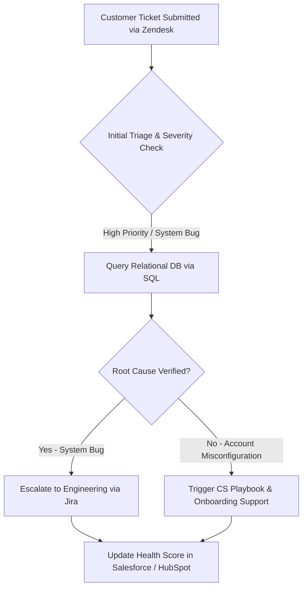

# 🔄 B2B Customer Operations & Escalation Architecture

This document outlines the cross-functional workflow for handling technical customer support, database verification, and engineering escalation to protect Net Revenue Retention (NRR).

## 🛠️ Omnichannel Escalation Flowchart

## 📋 Process Breakdown
1. **Triage & Classification:** Support agents log ticket severity via Zendesk Omnichannel.
2. **Data-Driven Root Cause Analysis:** SQL queries identify if the issue is a data integrity error, profile bug, or account setting[cite: 3].
3. **Cross-Functional Resolution:** Engineering bugs are tracked via Jira, while account issues are routed to Customer Success.
